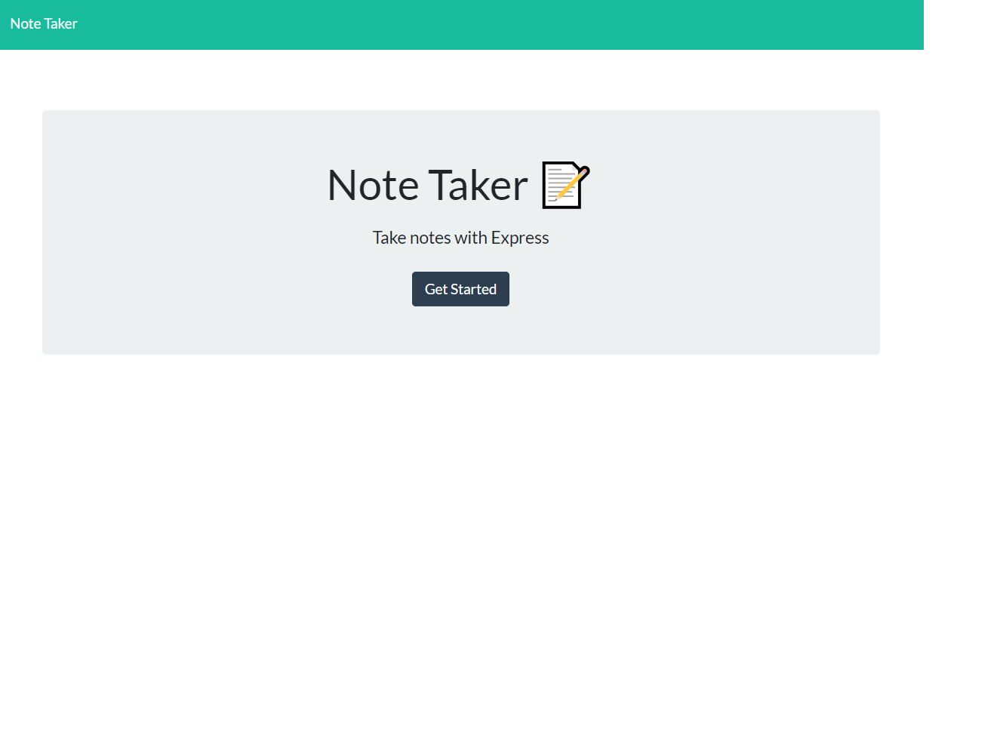

# Note Taker

This application will write, save and delete notes using express to send and retrieve user data.

Run `npm install` to install all of the dependencies. To use the application locally, run node server.js in your CLI, and then open http://localhost:3000 in your preferred browser. The Note Taker app was deployed to Heroku.

# Heroku Live Site

https://hey-take-notes.herokuapp.com/

In order to deploy a Heroku application, a Heroku account must be created with a unique application title. The Heroku CLI must be installed on your device. Open an integrated terminal on the `server.js` file and type `heroku login` then confirm the login. Type `git init` to initialize in the Git repository, followed by `heroku git:remote -a "title goes here"`. To push your changes type `git add .`, ` git commit -am "initial commit"`, `git push heroku`. To open the file, type `heroku open`.

# Preview

